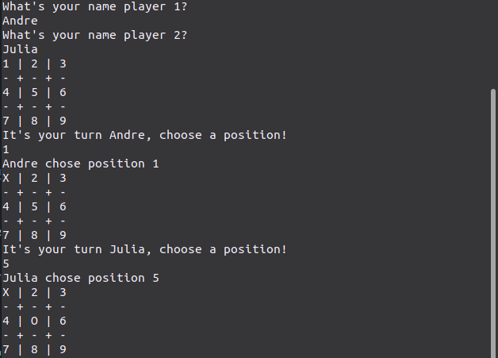

# Tic-Tac-Toe
This project is part of [The Odin Project](https://www.theodinproject.com/paths/full-stack-ruby-on-rails/courses/ruby-programming/lessons/tic-tac-toe) Full Stack Ruby curriculum.

)

## Description
This implementation of the Tic-Tac-Toe game is played against another player on the Terminal where both player take turns to put 'X' or 'O' marks in a 3 by 3 grid.

## Rules
The game follows the [Tic-Tac-Toe](https://en.wikipedia.org/wiki/Tic-tac-toe) rules were:
* The player who succeeds in placing three of their marks in a horizontal, vertical, or diagonal row is the winner.
* If no player succeeds in making a row, the game ends with a draw.

## Built with
* Ruby

## Play Online
[Replit.com](https://replit.com/@Rmg92/odinTicTacToe?v=1) click on the green "Run" button

## Play Locally
### Prerequisites
You need to have Ruby installed to play locally.

### Procedure
Clone the repo to a folder of your preference:
```sh
git@github.com:Rmg92/odin_TicTacToe.git
```
cd into the folder and:
```sh
ruby tic_tac_toe.rb
```

## What I Learned
*  How to use and think in OOP
*  Ruby classes and methods
*  Scope

## Acknowledgments
* [The Odin Project](https://www.theodinproject.com/)
* [Github](https://github.com/)
* [Replit](https://replit.com/)